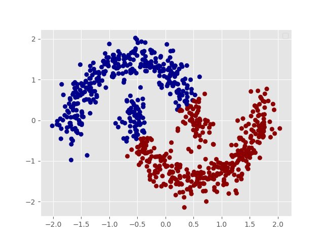

---?color=white
@title[Introduction]

# DBSCAN
#### Density-based Spatial Clustering of Applications with Noise

@snap[south-east span-20]
@size[0.75em](Luke Wileczek 2019-04-20)
@snapend

---
@title[clustering methods]

#### Can you name a clustering method?

<br>

@css[fragment](Did you say K-Means?)

+++
@title[K-Means]

## K-Means

@snap[text-left]
Why I don't like K-Means:
@snapend

  - Only works on [convex sets](https://en.wikipedia.org/wiki/Convex_set)
  - Even on perfect data sets, it can get stuck in a local minimum
  - Unevenly Sized Clusters
  - Fixed number of clusters, Always K cluster regardless of the truth
  - Everything [in here](https://stats.stackexchange.com/questions/133656/how-to-understand-the-drawbacks-of-k-means)

---
@title[What is DBSCAN]

@snap[north headline span-80]
@size[1.25em](What is DBSCAN?)
@snapend

@snap[west text-left span-50]
Unsupervised density-based clustering algorithm focusing on 
the distance between each point and the count of neighbors rather than the distance to a centroid.
@snapend

@snap[east span-50]

@snapend

+++
@title[Fromal definition]

Given a set of points in some space, it groups together points that are closely packed together (points with many nearby neighbors), marking as outliers points that lie alone in low-density regions (whose nearest neighbors are too far away). [Wiki](https://en.wikipedia.org/wiki/DBSCAN)

---
@title[Overview]

## Algorithm Overview

@snap[text-left]
When constructing the DBSCAN algorithm we need four things:
@snapend

@ul
  - Minimum amount of points (minPts)
  - Distance function (dist\_func)
  - Distance from each point (Eps)
  - data
@ulend

Note:
To compute DBSCAN we'll go point by point and check if it is a core point 
or not. 
If it is a core point we will create a new cluster, then search through 
all of its neighbors. 
We'll add the neighborhoods of all these points to the cluster. 
If one of the points is a core point as well, it's neighborhood will be 
added to our search. 
This will continue until we cannot reach anymore points. 
Then we'll move on to the next point that we haven't visited/labeled yet. 
Approaching the algorithm this way instead of calculating all of the distances 
at once will help to save memory.

+++
@title[overview continued...]

## Overview Continued

@snap[text-left]
We will follow the following ideas:
@snapend
  
@ul  
  1. Pick a point to start with  
  2. Find it's neighbors  
  3. Identify if it is a core point  
  4. Check if its neighbors are core points  
  5. connect the entire neighborhood into a cluster  
@ulend

+++

@title[Fun Fact 0]

### Fun fact time

Eps stands for epsilon, the Greek letter, which is used in mathematics to represent a region around an object. 
An arbitrary but common choice.

---
@title[intuition]

## Intuition
Let's build some Intuition before we start the code  
https://www.naftaliharris.com/blog/visualizing-dbscan-clustering/ 

--- 
@title[init Algorithm]

### Helper Functions

@[1-5]
@[7-11]

```python
def euclidean(x, y):
   """
   Calculate the euclidean distance between two vectors
   """
   return np.sqrt(np.sum((x-y)**2))

def find_neighbors(db, dist_func2, p, e):
   """
   return the indecies of all points within epsilon of p
   """
   return [idx for idx, q in enumerate(db) if dist_func2(p,q) <= e]
```

+++
@title[main function]

### Initiate Function & Variables
```
def dbscan(data, min_pts, eps, dist_func=euclidean):
   """
   Run the DBSCAN clustering algorithm
   """
   C = 0  # cluster counter
   labels = {}  # Dictionary to hold all of the clusters
   visited = np.zeros(len(data))  # for tracking
```

Note:
inital values and set default distance

+++

@title[for-loop]

### Track Visitation

```python
for idx, point in enumerate(data):
   # If already visited this point move on
   if visited[idx] == 1:
       continue
   visited[idx] = 1  # have now visited this point
   # all of point P's neighbors
   neighbors = find_neighbors(data, dist_func, point, eps)
```

+++

@title[if/then]

### Group the Clusters
@[1,2]
@[3-6]
@[7-9]
@[10-16]

```python
if len(neighbors) < min_pts:
   labels.setdefault('noise', []).append(idx)
else:
   C += 1
   labels.setdefault(C, []).append(idx)
   neighbors.remove(idx) # don't visit again
   for q in neighbors:
       if visited[q] == 1:
           continue
       visited[q] = 1
       q_neighbors = find_neighbors(data, 
          dist_func, data[q, :], eps)
       if len(q_neighbors) >= min_pts:
           # extend the search
           neighbors.extend(q_neighbors)
       labels[C].append(q)  # add to cluster
```

+++
@title[Full function]

### The Whole Shabang

```python
def dbscan(data, min_pts, eps, dist_func=euclidean):
   C = 0
   labels = {}
   visited = np.zeros(len(data))
   for idx, point in enumerate(data):
       if visited[idx] == 1:
           continue
       visited[idx] = 1
       neighbors = find_neighbors(data, dist_func, point, eps)
       if len(neighbors) < min_pts:
           labels.setdefault('noise', []).append(idx)
       else:
           C += 1
           labels.setdefault(C, []).append(idx)
           neighbors.remove(idx)
           for q in neighbors:
               if visited[q] == 1:
                   continue
               visited[q] = 1
               q_neighbors = find_neighbors(
                   data, dist_func, data[q, :], eps)
               if len(q_neighbors) >= min_pts:
                   neighbors.extend(q_neighbors)
               labels[C].append(q)

   return labels
```

---
@title[example]
@snap[north]
@size[1.15em](Example Time)
@snapend

@snap[west span-50]

@snapend

@snap[east span-50]

@snapend

+++
@title[e.g. k-means]

@snap[north]
@size[1.15em](K-Means Failure)
@snapend

@snap[west span-50]

@snapend

@snap[east span-50]  

@snapend

+++  
@title[e.g. dbscan]

@snap[north]
@size[1.15em](DBSCAN Results)
@snapend

@snap[west span-50]

@snapend  

@snap[east span-50]

@snapend

+++ 
@title[e.g. sci-kit]

@snap[north]
@size[1.15em](Sci-Kit Learn)
@snapend 

```python 
import numpy as np
from sklearn.cluster import DBSCAN
from sklearn.preprocessing import StandardScaler
from sklearn.datasets import make_moons
X, labels_true= make_moons(n_samples=750, shuffle=True, noise=0.11, random_state=42)
X = StandardScaler().fit_transform(X)
# Compute DBSCAN
db = DBSCAN(eps=0.3, min_samples=10).fit(X)
core_samples_mask = np.zeros_like(db.labels_, dtype=bool)
core_samples_mask[db.core_sample_indices_] = True
labels = db.labels_
# Number of clusters in labels, ignoring noise if present.
n_clusters_ = len(set(labels)) - (1 if -1 in labels else 0)
```

+++
@title[sk continue]

@snap[west text-left span-50]
Estimated number of clusters: 2  
Homogeneity: 0.995 
Completeness: 0.947   
V-measure: 0.970  
Adjusted Rand Index: 0.987  
Adjusted Mutual Information: 0.947  
Silhouette Coefficient: 0.225  
@snapend

@snap[east span-50]

@snapend

@snap[south-east span-35] 
@size[0.65em](Sci-Kit Learn example adapted from)
[here](http://scikit-learn.org/stable/auto_examples/cluster/plot_dbscan.html)
@snapend

---
@title[caveats]

## Caveats

  1. DBSCAN is not entirely deterministic
  2. The quality of DBSCAN depends on the distance measure used in the function regionQuery(P,ε)
  3. DBSCAN cannot cluster data sets well with large differences in densities
  4. If the data and scale are not well understood, choosing a meaningful 
  distance threshold ε can be difficult
  
Note: 
  - border points that are reachable from more than one cluster can be part of either cluster, 
  depending on the order the data are processed. For most data sets and domains, 
  this situation fortunately does not arise often and has little impact on the clustering result: 
  both on core points and noise points, DBSCAN is deterministic. DBSCAN* is a variation 
  that treats border points as noise, and this way achieves a fully deterministic result 
  as well as a more consistent statistical interpretation of density-connected components.
  - The most common distance metric used is Euclidean distance. 
  Especially for high-dimensional data, this metric can be rendered almost useless due to the so-called 
  "Curse of dimensionality", making it difficult to find an appropriate value for ε. 
  This effect, however, is also present in any other algorithm based on Euclidean distance.


---
@title[Future Reading]

## Futher Reading

  - [DBSCAN Wiki](https://en.wikipedia.org/wiki/DBSCAN)
  - [Sci-Kit Learn Clustering](http://scikit-learn.org/stable/modules/clustering.html#clustering)
  - [OPTICS algorithm](https://en.wikipedia.org/wiki/OPTICS_algorithm)
  - [Hierarchical
    clustering](https://en.wikipedia.org/wiki/Hierarchical_clustering)

---
  
@title[end]

# _fin_
